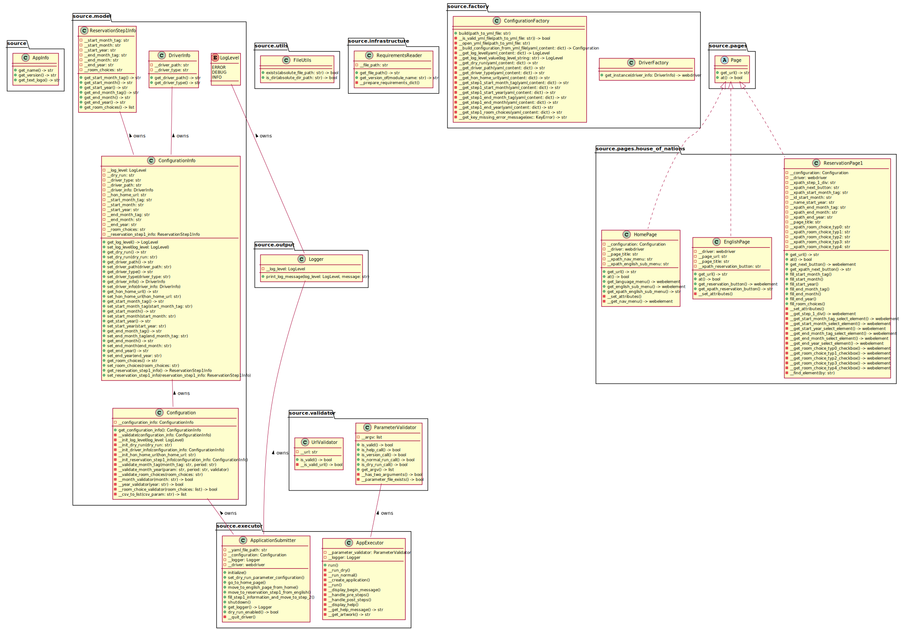

# application-automizer

### Table of Contents
*  [00. About Application](#about-application)
*  [01. UML](#uml)
*  [02. DDD](#ddd)
*  [03. Metrics](#metrics)
*  [04. Clean Code Development](#clean-code-development)
*  [05. Build Management](#build-management)
*  [06. Unit-Tests](#unit-tests)
*  [07. Continuous Delivery](#continuous-delivery)
*  [08. IDE](#ide)
*  [09. DSL](#dsl)
*  [10. Functional Programming](#functional-programming)

### <a name="about-application"></a>00. About Application

A simple command line application that automates the online reservation of available rooms/apartments in 
[House of Nations](https://www.house-of-nations.de/) website. I have used *Python* to develop the project and the 
required libraries are listed in [requirements.txt](requirements.txt). I have used selenium chrome webdriver for 
my project and this is the only external dependency. The latest chrome driver can be found [here](https://chromedriver.chromium.org/downloads).


For this command line tool to work it is necessary to provide the configuration through the [config.yml](resource/config.yml).
```YAML
# set the log level to either "ERROR", "DEBUG" or "INFO"
# to set the precision of error messages
log_level: "INFO"

# set this property if you would only like to execute a dry run.
# If you don't want to submit the final form set this property to "yes".
# If you do not want to use dry run mode, just set this property to "no".
dry_run: "no"

# set this property to target driver executable path
driver_path: "C:\\Users\\saurav\\Downloads"

# set this property to target driver type
driver_type: "chrome"

# set this property to house_of_nations current Home Page url
hon_home_url: "https://www.house-of-nations.de/"

# set this property to start month tag
# valid options = ["Beginning of", "Middle of"]
step1.start_month_tag: "Middle of"

# set this property to start month
# valid options = [
#   "January", "February", "March", "April", "May", "June",
#   "July", "August", "September", "October", "November", "December"
# ]
step1.start_month: "March"

# set this property to start year
step1.start_year: "2021"

# set this property to end month tag
# valid options = ["End of", "Middle of"]
step1.end_month_tag: "Middle of"

# set this property to end month
# valid options similar as step1.start_month
step1.end_month: "January"

# set this property to end year
step1.end_year: "2022"

# set this property to preferred room choices separated by comma
# EZ  - Single Room
# EA  - Single Apartment
# EA2 - Single Apartment for 2 persons
# DA  - Double Apartment
# DAB - Double Apartment, handicapped accessible
# valid choices: "EZ,EA,EA2,DA,DAB"
step1.room_choices: "EZ,EA"
```   

### <a name="uml"></a>01. UML
The Unified Modeling Language is a set of notation elements that can be used to develop models for software systems. 
This concerns the analysis, design and in general the presentation and documentation of the software elements or the 
software behavior. I have used [PlantUML](https://plantuml.com/) to design the UML diagrams of my project. PlantUML 
uses simple and intuitive language to design the diagrams. The sources are stored in *.puml* files which I continue 
to update as I make changes in the project to reflect visually in diagrams. 

**Use Case Diagram**

Use Case Diagram presents the actors and their cases of application. I have depicted my project's use cases marking 
also the actors in my program. The source can be found in [plant-uml/use_case_diagram.puml](plant-uml/use_case_diagram.puml). 


**Activity Diagram**

Activity Diagram shows how the program works by using actions, transitions and branches. In this diagram I have tried 
to visualize the total actions flow of my program with important actions and the branches. The source can be found in 
[plant-uml/activity_diagram.puml](plant-uml/activity_diagram.puml).


**Class Diagram**

Class Diagram represents the classes of the respective programming language and their relationships. All the fields 
and functions that I defined in the classes for the project, the relationships, visibility and package structure can 
be visualized through this diagram. The source can be found in [plant-uml/class_diagram.puml](plant-uml/class_diagram.puml).



### <a name="ddd"></a>02. DDD

#### Strategic Domain Design

1. **Configuration Management** to manage the configuration required to run the application. Reading config.yml file, 
parsing and validating, creating the value object to be passed around where this is required are some tasks in this 
strategic part.

2. **Executors** a core domain which is used to maintain the execution flow of the application. Command 
Line arguments parsing, creating main app instance, managing webdriver states and main actions in one place can be seen 
as parts of this domain.

3. **Pages** for managing page properties, components and functionalities of different webpages of the House of Nations 
website. This is also a core domain and specific to requirements of this particular application.

4. **Factories** for creating instance of configuration and webdriver. This is supporting domain.

5. **Validators** for validating inputs. This also falls in supporting domain.

6. **Utils** provides utility functions. This is a generic domain.

 


### <a name="metrics"></a>03. Metrics  

I have used SonarCloud and SonarLint plugin in my IDE to analyze and generate metrics of my project to get insights of 
code quality.

[](https://sonarcloud.io/dashboard?id=sksdotsauravs-beuth_application-automizer) [](https://sonarcloud.io/dashboard?id=sksdotsauravs-beuth_application-automizer) [](https://sonarcloud.io/dashboard?id=sksdotsauravs-beuth_application-automizer) [](https://sonarcloud.io/dashboard?id=sksdotsauravs-beuth_application-automizer)

I also checked with Codacy online to analyse the code quality.

[](https://app.codacy.com/gh/sksdotsauravs-beuth/application-automizer?utm_source=github.com&utm_medium=referral&utm_content=sksdotsauravs-beuth/application-automizer&utm_campaign=Badge_Grade)

### <a name="clean-code-development"></a>04. Clean Code Development

The goal of clean code development is to develop sustainable code with good quality so that technical debts are minimal.

*[1-5] with code snippets to show:*

1. **Comments**: Useful comments to describe the tasks of functions and classes throughout the project by using docstring.

    [home_page.py](source/pages/house_of_nations/home_page.py)
    ```Python
    class HomePage(Page):
        """
            This class holds the information of home page, such as:
            it's url and other page elements.
        """
    ```
    ```Python
        def at(self) -> bool:
            """
                This method verifies if the browser is currently at page location
            """
    
            return self.__driver.title == self.__page_title
    ```
2. **Precise Naming**: Used self-explanatory and consistent naming for variables, functions, interfaces and classes.

    [application_submitter.py](source/executor/application_submitter.py)
    ```Python
    class ApplicationSubmitter:
        """
            This class holds the actual program functionality.
        """
    ```    
    ```Python
        def __init__(self, yaml_file_path):
            self.__yaml_file_path = yaml_file_path
            self.__configuration = None
            self.__logger = None
            self.__driver = None
    ```
    ```Python
        def set_dry_run_parameter_configuration(self):
            """
                This method will set the dry run parameter information inside configuration.
            """
    
            self.__configuration.configuration_info.dry_run = "yes"
    ```
   
3. **Single Responsibility Functions**: Tried to design and use functions in such a way so they have single tasks.

    [home_page.py](source/pages/house_of_nations/home_page.py)
    ```Python
        def get_url(self) -> str:
            """
                This method returns the page url
            """
    
            return self.__configuration.configuration_info.hon_home_url
    ```

4. **Exception Handling**: Used try-except-finally to avoid inconsistent application state.

    [app_executor.py](source/executor/app_executor.py)
    ```Python
        def __run(self, application):
            try:
                self.__display_begin_message()
                self.__handle_pre_steps()
                ...
                application.fill_step1_information_and_move_to_step_2(reservation_page1)
                self.__handle_post_steps()
            except Exception:
                self.__logger.print_log_message(LogLevel.ERROR, traceback.print_exc())
            finally:
                application.shutdown()
    ```
5. **Positive Conditionals**: Used positive conditionals and avoided negative conditionals for better readability.

    [configuration.py](source/model/configuration.py)
    ```Python
            if UrlValidator(hon_home_url).is_valid():
                self.__configuration_info.hon_home_url = hon_home_url
            else:
                raise ValueError("invalid value for hon_home_url...")
    ```

6. Organised code in well structured packages, e.g. model, pages. factory etc.

7. Used classes to encapsulate variables and functions, e.g. DriverInfo, ConfigurationInfo etc.

8. Used interfaces to design shared functionality of classes, e.g. Page.

9. Code abstraction maintained by declaring private and public variables and functions following python coding norms, 
such __ (double underscore) prefix to mark private scope and using property to expose private variables via 
getter-setter functions.

10. Used static methods when appropriate - code is not using instance variable and not dependent on instance creation.

11. Used exceptions with specific information.

12. Maintained as less as possible code duplication.

13. Used python convention for file, function and variable names in snake case and class names in camel case.

14. Maintained maximum 80 characters per line in code mostly.

15. Indentation maintained to separate logical blocks and to increase readability.


### <a name="build-management"></a>05. Build Management 

For build management I have used [**Bazel**](https://docs.bazel.build/versions/master/be/python.html). Bazel uses Starlark programming language. After installing bazel I 
configured **2** essential files to build my project. 

1. In bazel realm the project root or where the source files reside is considered as workspace and this directory needs 
to have a text file called **WORKSPACE**. This file can be empty or have rules to define the external dependencies that 
are required to build the project. In my project I am using **pip_install** rule to configure the required dependencies 
through requirements.txt file.

    [WORKSPACE](WORKSPACE)
    ```Starlark
    load("@rules_python//python:pip.bzl", "pip_install")
    pip_install(
        # (Optional) You can provide a python_interpreter (path) or a python_interpreter_target (a Bazel target, that
        # acts as an executable). The latter can be anything that could be used as Python interpreter. E.g.:
        # 1. Python interpreter that you compile in the build file (as above in @python_interpreter).
        # 2. Pre-compiled python interpreter included with http_archive
        # 3. Wrapper script, like in the auto-detecting python toolchain.
        python_interpreter = "C://Users//saurav//PycharmProjects//application-automizer//venv//Scripts//python",
        
        # Uses the default repository name "pip"
        requirements = "//:requirements.txt",
    )
    ```
2. The second file is **BUILD** file. The directory that contains this file is considered as a package. A package 
includes all files in its directory, plus all subdirectories beneath it, except those which themselves contain a BUILD 
file. In this build file I mainly configure two rules - **py_binary** and **py_test**. A **py_binary** is an executable 
python program consisting of all the source code and data needed by the program at run-time with the correct initial 
environment and data. And a py_test() rule compiles a test which is a binary wrapper around some test code.

    [BUILD](BUILD)
    ```Starlark
    load("@rules_python//python:defs.bzl", "py_binary", "py_test")
    load("@pip//:requirements.bzl", "requirement")
    
    py_binary(
        name = "app",
        srcs = glob([
            "source/executor/*.py",
            "source/factory/*.py",
            "source/infrastructure/*.py",
            "source/model/*.py",
            "source/output/*.py",
            "source/pages/**/*.py",
            "source/pages/*.py",
            "source/utils/*.py",
            "source/validator/*.py",
            "source/*.py",
            "*.py"
        ]),
        data = glob([
            "resource/*.yml",
            "*.txt"
        ]),
        deps = [
            requirement("beautifulsoup4"),
            requirement("selenium"),
            requirement("pyyaml"),
            requirement("validators")
        ]
    )
    
    py_test(
        name = "infrastructure_test",
        srcs = [
            "tests/infrastructure_test.py"
        ],
        deps = [":app"]
    )
    ```
3. The important commands of bazel which I also use in my Jenkins pipeline are:

    a. To clean the previous build files from project environment
    ```PowerShell
    bazel clean
    ```
    b. To build the project (app: py_binary name) 
    ```PowerShell
    bazel build app
    ```
    
    c. To execute all the tests 
    ```PowerShell
    bazel test :*
    ```
    
    d. To run the project 
    ```PowerShell
    bazel run app -- config.yml
    ```

### <a name="unit-tests"></a>06. Unit-Tests

I have written several unit-tests and used similar package structure as source to manage them. All this tests can be 
found under [tests](tests) directory. Some code snippets of those tests are as below:

1. [file_utils_test.py](tests/utils/file_utils_test.py)
    ```Python
    import os
    import unittest

    from source.utils.file_utils import FileUtils


    class FileUtilsTest(unittest.TestCase):
        """
            This class performs unit tests for the public methods
            in the @FileUtils class
        """
    
        def setUp(self) -> None:
            self.__file_path = os.path.abspath(__file__)
    
        def test_exists(self):
            self.assertTrue(FileUtils.exists(self.__file_path))
    
        def test_exists_with_non_existing_file(self):
            self.assertFalse(FileUtils.exists('C:\\invalid_file.xyz'))
    
        def test_is_dir(self):
            self.assertTrue(FileUtils.is_dir(os.path.dirname(self.__file_path)))
    
        def test_is_dir_when_dir_does_not_exist(self):
            self.assertFalse(FileUtils.is_dir(self.__file_path))


    if __name__ == '__main__':
        unittest.main()
    ```

2. [url_validator_test.py](tests/validator/url_validator_test.py)

    ```Python
    def test_is_valid(self):
        validator = UrlValidator("https://www.beuth-hochschule.de/")
        self.assertTrue(validator.is_valid())

    def test_is_valid_with_invalid_url(self):
        validator = UrlValidator("invalid_url")
        self.assertFalse(validator.is_valid())
    ```

3. [parameter_validator_test.py](tests/validator/parameter_validator_test.py)

    ```Python
    def setUp(self) -> None:
        self.__app_param = "app.py"
        self.__version_param = "--version"
        self.__help_param = "--help"
        self.__config_file_param = os.path.abspath(
            os.path.join("resource", "config.yml")
        )
        self.__dry_run_param = "--dry-run"
    
    def test_get_argv(self):
        expected_argv = list()
        expected_argv.append(self.__app_param)
        expected_argv.append(self.__config_file_param)
        self.assertEqual(
            expected_argv,
            ParameterValidator(
                [self.__app_param, self.__config_file_param]
            ).get_argv()
        )
    
    def test_is_help_call(self):
        argv = [self.__app_param, self.__help_param]
        self.assertTrue(ParameterValidator(argv).is_help_call())
    
    def test_is_version_call(self):
        argv = [self.__app_param, self.__version_param]
        self.assertTrue(ParameterValidator(argv).is_version_call())
    
    def test_is_normal_run_call(self):
        argv = [self.__app_param, self.__config_file_param]
        self.assertTrue(ParameterValidator(argv).is_normal_run_call())
    
    def test_is_dry_run_call(self):
        argv = [self.__app_param, self.__config_file_param, self.__dry_run_param]
        self.assertTrue(ParameterValidator(argv).is_dry_run_call())
    
    def test_is_valid(self):
        argv = [self.__app_param, self.__config_file_param]
        self.assertTrue(ParameterValidator(argv).is_valid())
    
    def test_is_valid_with_invalid__argv(self):
        argv = [self.__config_file_param]
        self.assertFalse(ParameterValidator(argv).is_valid())
    ```


### <a name="continuous-delivery"></a>07. Continuous Delivery 

For continuous delivery I have used [Jenkins](https://www.jenkins.io/) pipeline job. Pipeline jobs can be enabled in Jenkins by installing the 
Pipeline plugin. They use simple text scripts known as Pipeline DSL based on Groovy programming language. The pipeline 
that I am using at this moment contains 5 stages.

1. Preparation: This stage is used to do some preparatory steps like setting up environment variables.
2. SCM Checkout: Checkout the application-automizer project from GitHub given the branch name via build parameter.
3. Build: In this stage I use batch command to run bazel clean and bazel build.
4. Unit-Test: I use bazel test command to run the unit-tests of my project.
5. Dry-Run: Execute the bazel run command with --dry-run command argument to run the application within limited scope. 

[Jenkinsfile_application-automizer]
```Groovy
pipeline {
    
    agent {
        node {
            label 'node-automation'
        }
    }
    
    parameters {
        gitParameter name: 'BRANCH', 
                     type: 'PT_BRANCH_TAG',
                     defaultValue: 'origin/main'
    }
    
    environment {
        GIT_SSH_CREDENTIALS = 'SSH.DESKTOP-TN2H62U.saurav'
        GITHUB_BASE_URL = 'https://github.com/sksdotsauravs-beuth/'
        PROJECT_APPLICATION_AUTOMIZER = 'application-automizer'
        APPLICATION_AUTOMIZER_GIT_PATH = 'application-automizer.git'
        EXTERNAL_CONFIG_FILE = 'C:\\Users\\saurav\\PycharmProjects\\application-automizer\\resource\\config.yml'
    }
    
    options {
        buildDiscarder(
            logRotator(
                artifactNumToKeepStr: '25',
                numToKeepStr: '25'
            )
        )
        ansiColor('xterm')
    }

    stages {

        stage('Preparation') {
            steps {
                echo "preparing ${env.JOB_NAME} job..."
                bat 'set'
            }
        }
        
        stage('SCM Checkout: application-automizer') {
            steps {
                echo "checking out ${env.PROJECT_APPLICATION_AUTOMIZER} project..."
                checkout([
                    $class: 'GitSCM', 
                    branches: [[name: "${params.BRANCH}"]], 
                    doGenerateSubmoduleConfigurations: false, 
                    extensions: [], 
                    gitTool: 'Default', 
                    submoduleCfg: [], 
                    userRemoteConfigs: [[
                        credentialsId: env.GIT_SSH_CREDENTIALS,
                        url: env.GITHUB_BASE_URL+env.APPLICATION_AUTOMIZER_GIT_PATH
                    ]]
                ])
            }
        }
        
        stage('Build: application-automizer') {
            steps {
                echo "building ${env.PROJECT_APPLICATION_AUTOMIZER} project..."
                
                script {
                    command = 'bazel clean'
                    output = bat (
                        script: command,
                        returnStdout: true
                    ).trim()
                    echo "[${command}] output: ${output}"
                    
                    command = 'bazel build app'
                    output = bat (
                        script: command,
                        returnStdout: true
                    )
                    echo "[${command}] output: ${output}"
                }
            }
        }
        
        stage('Unit Test: application-automizer') {
            steps {
                echo "executing unit-tests of ${env.PROJECT_APPLICATION_AUTOMIZER} project..."
                
                script {
                    command = 'bazel test :*'
                    output = bat (
                        script: command,
                        returnStdout: true
                    )
                    echo "[${command}] output: ${output}"
                }
            }
        }
        
        stage('Dry-Run: application-automizer') {
            steps {
                echo "executing dry-run of ${env.PROJECT_APPLICATION_AUTOMIZER} project..."
                
                script {
                    command = 'bazel run app -- ' + env.EXTERNAL_CONFIG_FILE + ' --dry-run'
                    output = bat (
                        script: command,
                        returnStdout: true
                    )
                    echo "[${command}] output: ${output}"
                }
            }
        }
    }
}
```


### <a name="ide"></a>08. IDE 

For developing my project I have used [PyCharm](https://www.jetbrains.com/pycharm/) Community Edition. PyCharm is an 
integrated development environment specifically for Python language. PyCharm has keyboard shortcuts for most of the
operations related to editing, navigation, refactoring, debugging, and other tasks. 

Some of my favourite keyboard shortcuts are: 

1. <kbd>Alt</kbd> + <kbd>Shift</kbd> + <kbd>F9</kbd> = Debug
2. <kbd>Ctrl</kbd> + <kbd>Shift</kbd> + <kbd>Up/Down</kbd> = Move statement up and down
3. <kbd>Shift</kbd> + <kbd>F6</kbd> = Rename
4. <kbd>Ctrl</kbd> + <kbd>K</kbd> = Opens up commit sub-window
5. <kbd>Alt</kbd> + <kbd>F7</kbd> = Find usage
6. <kbd>Ctrl</kbd> + <kbd>Alt</kbd> + <kbd>S</kbd> = Opens up settings sub-window
7. <kbd>Shift</kbd> + <kbd>Shift</kbd> = Search for a file
8. <kbd>Ctrl</kbd> + <kbd>Shift</kbd> + <kbd>F</kbd> = Search for a text in any scope


### <a name="dsl"></a>09. DSL

For my application I use some special command line arguments that are specific to my application domain and performs 
different tasks. The commands and outputs are listed below:

1. Command:
    ```PowerShell
    python app.py --version
    ```
    Output:
    ```
    2021.2.0
    ```

2. Command:
    ```PowerShell
    python app.py --help
    ```
    Output:
    ```
    ********************************************************************
                                    Help
    ********************************************************************
    
    Command                                 Description
    --------------------------------------------------------------------
    python app.py config.yml                runs the application
    ....................................................................
    python app.py config.yml --dry-run      runs the application except
                                            submitting final form
    ....................................................................
    python app.py --version                 prints out the current
                                            application version
    ....................................................................
    ```
3. Command:
    ```PowerShell
    python app.py --config.yml --dry-run
    ```
    Output:
    ```
    >>> Process 'C:\Users\saurav\PycharmProjects\application-automizer\resource\config.yml'...
    >>> Execute preparation actions...
    >>> Executing dry-run...
    ...
    ```

### <a name="functional-programming"></a>10. Functional Programming
I have used functional programming in different places of my project. Here I have listed 3 cases.

1. To validate month and year parameters provided via config.yml

    The **__month_validator()** and **__year_validator()** are two First-Class functions. The **__validate_month_year()** 
    is a Higher-Order function that takes either of this two function as **validator** argument to validate the input. 
    
    [configuration.py](source/model/configuration.py)
    
    ```Python
    def __month_validator(month: str) -> bool:
        valid_months = [
            "January", "February", "March",
            "April", "May", "June",
            "July", "August", "September",
            "October", "November", "December"
        ]
        return month in valid_months
    
    
    def __year_validator(year: str) -> bool:
        max_year_limit = 5
        current_year = datetime.now().year
        return current_year <= int(year) <= (current_year + max_year_limit)
    
    
    def __validate_month_year(self, param: str, period: str, validator):
        param_type = "month" if validator.__name__.startswith("__month") else "year"
        if validator(param):
            if period == "start" and param_type == "month":
                self.__configuration_info.start_month = param
            elif period == "end" and param_type == "month":
                self.__configuration_info.end_month = param
            elif period == "start" and param_type == "year":
                self.__configuration_info.start_year = param
            elif period == "end" and param_type == "year":
                self.__configuration_info.end_year = param
        else:
            raise ValueError(f"invalid value for {period}_{param_type}...")
    
    # use-case
    self.__validate_month_year(
        param=configuration_info.start_month,
        period="start",
        validator=Configuration.__month_validator
    )
    ```
2. To find element in pages based on different tags.

    The **__find_element()** is a Higher-Order function that uses one of the nested functions as return value.
    
    [reservation_page1.py](source/pages/house_of_nations/reservation_page1.py)

    ```Python
    def __find_element(by: str):
        def find_element_by_xpath(driver: webdriver, element_xpath: str) -> webelement:
            return driver.find_element_by_xpath(element_xpath)

        def find_element_by_id(driver: webdriver, element_id: str) -> webelement:
            return driver.find_element_by_id(element_id)

        def find_element_by_name(driver: webdriver, element_name: str) -> webelement:
            return driver.find_element_by_name(element_name)

        if by == "xpath":
            return find_element_by_xpath
        elif by == "id":
            return find_element_by_id
        elif by == "name":
            return find_element_by_name
    
    # use-case
    def __get_start_month_tag_select_element(self) -> webelement:
        xpath_finder = ReservationPage1.__find_element(by="xpath")
        return xpath_finder(
            driver=self.__driver,
            element_xpath=self.__xpath_start_month_tag
        )
    ```

3. To validate room choices.

    The **__room_choice_validator()** uses lambda or anonymous function to filter valid choices.
 
    [configuration.py](source/model/configuration.py)
    
    ```Python
    def __room_choice_validator(room_choices: list) -> bool:
        valid_room_choices = ["EZ", "EA", "EA2", "DA", "DAB"]
        filtered = filter(lambda x: x in valid_room_choices, room_choices)
        return True if sorted(filtered) == sorted(room_choices) else False
    ```

