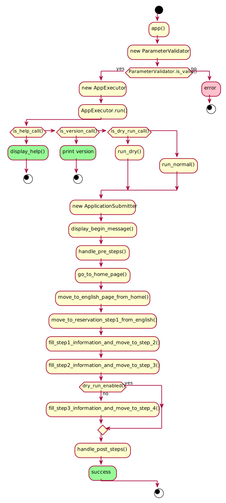

# application-automizer
A simple command line application that automates the online reservation of available rooms/apartments in 
[House of Nations](https://www.house-of-nations.de/) website. I have used *Python* to develop the project and the 
required libraries are listed in [requirements.txt](requirements.txt). I have used selenium chrome webdriver for 
my project and this is only the external dependency. The latest chrome driver can be found [here](https://chromedriver.chromium.org/downloads).


Help can be found about how to use the tool using (after going to project root directory in shell):
```PowerShell
python app.py --help
```


As it is a command line tool it is necessary to provide the configuration through the [config.yml](resource/config.yml).
```YAML
# set the log level to either "ERROR", "DEBUG" or "INFO"
# to set the precision of error messages
log_level: "INFO"

# set this property if you would only like to execute a dry run.
# If you don't want to submit the final form set this property to "yes".
# If you do not want to use dry run mode, just set this property to "no".
dry_run: "no"

# set this property to target driver executable path
driver_path: "C:\\Users\\saurav\\Downloads"

# set this property to target driver type
driver_type: "chrome"

# set this property to house_of_nations current Home Page url
hon_home_url: "https://www.house-of-nations.de/"

# set this property to start month tag
# valid options = ["Beginning of", "Middle of"]
step1.start_month_tag: "Middle of"

# set this property to start month
# valid options = [
#   "January", "February", "March", "April", "May", "June",
#   "July", "August", "September", "October", "November", "December"
# ]
step1.start_month: "March"

# set this property to start year
step1.start_year: "2021"

# set this property to end month tag
# valid options = ["End of", "Middle of"]
step1.end_month_tag: "Middle of"

# set this property to end month
# valid options similar as step1.start_month
step1.end_month: "January"

# set this property to end year
step1.end_year: "2022"

# set this property to preferred room choices separated by comma
# EZ  - Single Room
# EA  - Single Apartment
# EA2 - Single Apartment for 2 persons
# DA  - Double Apartment
# DAB - Double Apartment, handicapped accessible
# valid choices: "EZ,EA,EA2,DA,DAB"
step1.room_choices: "EZ,EA"
```   

### 01. UML
The Unified Modeling Language is a set of notation elements that can be used to develop models for software systems. 
This concerns the analysis, design and in general the presentation and documentation of the software elements or the 
software behavior. I have used [PlantUML](https://plantuml.com/) to design the UML diagrams of my project. PlantUML 
uses simple and intuitive language to design the diagrams. The sources are stored in *.puml* files which I continue 
to update as I make changes in the project to reflect visually in diagrams. 

**Use Case Diagram**

Use Case Diagram presents the actors and their cases of application. I have depicted my project's use cases marking 
also the actors in my program. The source can be found in [plant-uml/use_case_diagram.puml](plant-uml/use_case_diagram.puml). 


**Activity Diagram**

Activity Diagram shows how the program works by using actions, transitions and branches. In this diagram I have tried 
to visualize the total actions flow of my program with important actions and the branches. The source can be found in 
[plant-uml/activity_diagram.puml](plant-uml/activity_diagram.puml).



**Class Diagram**

Class Diagram represents the classes of the respective programming language and their relationships. All the fields 
and functions that I defined in the classes for the project, the relationships, visibility and package structure can 
be visualized through this diagram. The source can be found in [plant-uml/class_diagram.puml](plant-uml/class_diagram.puml).


### Metrics (Code Quality)

[](https://sonarcloud.io/dashboard?id=sksdotsauravs-beuth_application-automizer)

[](https://sonarcloud.io/dashboard?id=sksdotsauravs-beuth_application-automizer) [](https://sonarcloud.io/dashboard?id=sksdotsauravs-beuth_application-automizer) [](https://sonarcloud.io/dashboard?id=sksdotsauravs-beuth_application-automizer) [](https://sonarcloud.io/dashboard?id=sksdotsauravs-beuth_application-automizer)

